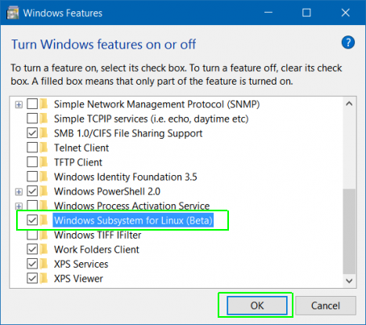
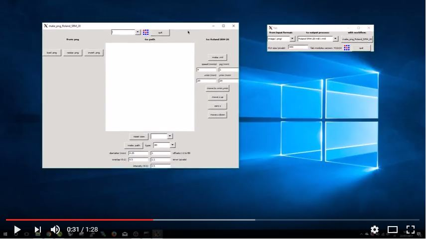

# Fabmodules: Install on Windows10
**Original tutorial by:**
* Antonio Grillo - [ntngrillo@gmail.com](mailto:ntngrillo@gmail.com) - Last updated 2017-07-24
* FabLab Napoli - Naples, IT
* License: MIT

## Step_1
Navigate to ````Settings````. You can get there by clicking on the gear icon in the Start menu.

Click ````Update & security```` and go to ````Select For Developers```` in the left column.

Select ````Developer Mode```` under ````Use developer features```` if it's not already enabled.


## Step_2
Navigate to the ````Control Panel```` (the old Windows control panel). You can get there by hitting ````Windows Key + X```` and selecting Control panel from the pop-up menu that appears.

Select ````Programs and Features````. If it's not visible, make sure you select "Large icons" from the "View by" menu.


Click ````Turn Windows features on or off.````

Toggle ````Windows Subsystem for Linux (Beta)```` to on and click Ok and reboot your computer.



## Step_3
Search for Command Prompt (cmd.exe) in the Cortana / Search box and click its icon.
Type ````bash```` and hit ````Enter````
Type ````y```` and hit ````Enter```` when promoted to install Ubuntu. The system will then take a few minutes to install Ubuntu in the command prompt window.

## Step_4
At this point you can follow the guide @ http://kokompe.cba.mit.edu/downloads.html

    Dependencies: Ubuntu 12.04

    - Python
    - wxPython
    - NumPy
    - GCC and G++
    - libpng
    - GIFLIB
    - Make
    - BASH
    - Okular
    - Boost (headers, thread, and system library)
    - cmake

You can install all of the dependencies with the command:

    sudo apt-get install python python-wxgtk2.8 python-dev python-pip gcc g++ libpng12-dev libgif-dev make bash okular libboost-thread-dev libboost-system-dev cmake    

[DOWNLOAD](http://kokompe.cba.mit.edu/fab_src.zip) All Modules

After downloading the source above, unzip ````fab_src.zip```` and cd to the folder it's in.

Type ````make fab````, which should compile all executables and copy scripts into bin.

At this point, ````make install```` will copy all executables and scripts to ````/usr/local/bin````

## Step_5
You need to install an **"X server"** to provide that graphical interface which is yet not there on a typical Ubuntu subsystem on windows 10.

If you install an X server application on your Windows desktop and change a setting in the Bash shell, applications will send their graphical output to the X server application and they’ll appear on your Windows desktop.

You can install [Xming](https://sourceforge.net/projects/xming/) a good X server for Windows. Just accept the default settings. It will then automatically launch and run in your system tray, waiting for you to run graphical programs.

----
After installation you’ll need to set the **DISPLAY** environment variable to point at the X server already running on your system.

First run the following command in the Bash environment to set the DISPLAY variable:

    export DISPLAY=:0

And then ***run the application:***

    fab


[](https://youtu.be/hwmLH4IqZVI)

:tada: Enjoy your **Fabmodules for Windows**!! :tada:
